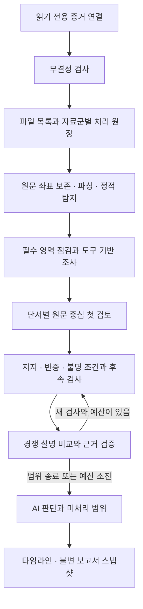

# 조사 설계와 검증 경계

## 제품 흐름

증거를 연결하고 조사를 시작하면 로컬 도구와 모델이 조사 결과를 자동 생성합니다. 분석가 승인·제외는 필수 단계가 아닙니다. 확인·유력·미확인은 검토한 주장의 근거 수준이며, 미처리·실패·미지원은 별도 상태입니다.

## 현재 구현의 실제 범위

| 단계 | 구현 | 한계 |
| --- | --- | --- |
| 수집 | Linux 할당 파일 목록, 자료군별 바이트 예산, 해시와 읽기 결과 | 파일 목록 전수성과 내용 전수 분석은 다릅니다. 미할당·메모리·미지원 형식은 제외됩니다. |
| 정제 | 인식한 로그와 정적 규칙 일치의 원문 범위·반복 관찰·좌표를 보존 | 인식되지 않은 모든 원문이 자동으로 모델 검토 대상이 되지는 않습니다. 미선정 파일도 자료원 목록에 남기며 최대 16개 고정 표본을 별도 원문 검토합니다. |
| 탐색 | 필수 자료 보완, 정적 연결 분석, 제한된 LangGraph 도구 루프 | 보존 원문 검색에서 부재는 전체 이미지나 과거 행위의 부재가 아닙니다. |
| 검토 | 단서 큐와 기본 자료군·미분류 표본, 자료원/시각 분산 선택 후 이전 평가와 비교 | 같은 모델과 수집 경로를 공유합니다. 통계적으로 독립된 검증이 아닙니다. 모든 기록을 모델이 읽는 것도 아닙니다. 근거가 없는 baseline은 자료 부족이며 등급으로 합산하지 않습니다. |
| 판단 | 주장 단계별 인용 검사, 가설별 검사 계약, 실패한 결과 분리 | 인용 ID가 맞아도 자연어 해석이 틀릴 수 있습니다. |
| 표시 | 현재 검토된 주장만 등급 합산, 과거 판단·시각 미확인 분리 | 차트에 점이 없는 시간은 정상 기간을 의미하지 않습니다. |
| 복구 | 작업 예약, 세대·attempt 확인, 불변 영수증, checkpoint | 실행 결과 불명 상태는 자동 성공이나 무조건 재실행으로 바꾸지 않습니다. |

## 예산과 종료

LangGraph 조사 task의 기본 예산은 계획 모델 12회·탐색 도구 36회이며, 별도로 검토 모델 5회·경쟁 설명 검사 10회가 있습니다. 12회·36회는 전체 그래프의 합산 상한이 아닙니다. 이후 단서 판단 task의 일반 예산은 모델 576회·도구 72회이고, 제한 복구 예약을 포함한 절대 상한은 582회·76회입니다. 이 수치를 사건 전체의 모든 도구/모델 호출 상한으로 표현하지 않습니다. 단서 큐는 최대 256개이며, 범위를 초과한 단서는 보류 기록으로 남깁니다.

검토 종료는 침해 확정이나 시스템 정상 판정을 의미하지 않습니다. 원문 부족, 지원하지 않는 형식, 모델 실패, 검사 미평가, 예산 소진을 최종 결과에 보존합니다. 재읽은 같은 파일은 독립 발생원으로 세지 않습니다.

로그 생성과 보존 연속성의 독립 확인을 아직 제공하지 않으므로, 완료된 검색의 0건 결과도 행위 부재의 반증으로 채택하지 않습니다. 이전 generation의 판단은 현재 결과에서 제외하고 불변 이력으로 보존합니다.

사건에는 로드한 코드와 설정된 모델의 fingerprint를 저장하며, 조합이 바뀌면 같은 사건의 진행을 중단합니다. 검증 배포에서는 `FRONTIER_RELEASE`, `FRONTIER_WORKER_IMAGE`, `FRONTIER_MODEL_DIGEST`를 실제 식별값으로 지정하고 Docker 이미지 digest를 시작 영수증과 함께 보존합니다. Ollama 모델 digest를 지정하면 실제 호출 전 일치 여부를 확인합니다. 값이 없는 일반 설치는 `unrecorded`/`unverified`로 기록되며, 검증된 배포 조합이라고 표현하지 않습니다.

## 검증 단계

모델 digest를 고정한 검증 배포에서는 반증 모델을 비우거나 기본 모델과 같게 설정합니다. 별도 반증 모델을 지정하면 호출 전에 거절합니다. 일반 설치에서 고정하지 않은 모델 조합은 검증된 실행 조합으로 표시하지 않습니다.

검증 배포에서 `FRONTIER_WORKER_SOURCE_SHA256`를 지정하면 작업 예약·재개 및 모델 응답 채택 경계에서 인증된 worker runtime 응답을 대조합니다. worker는 전체 소스·의존성 잠금값을 내용 캐시 키에 포함하고, 다른 실행 코드가 만든 작업 envelope는 재사용하지 않습니다. Docker 이미지 식별값은 호스트 검사 영수증에 보존하며 앱에 Docker 소켓 권한을 주지 않습니다.

Compose의 controller와 worker는 내부 네트워크에만 연결합니다. 화면은 호스트 loopback에 공개한 gateway에서 고정 controller로 전달합니다. 로컬 모델 접근은 별도 relay를 거치며, relay는 고정된 로컬 주소의 모델 목록과 추론 경로만 허용합니다. 임의 URL·모델 삭제·파일 업로드·검색 프록시는 제공하지 않습니다. gateway와 relay에는 증거·사건 볼륨이 없고 요청 크기를 제한합니다. 분석 서비스의 외부 연결 차단과 화면 입구·모델 relay의 연결은 구분합니다.

1. 합성 입력으로 원문 좌표, 검색 경계, 파티션 선택, 인용 범위와 가설별 계약을 검사합니다.
2. Windows와 Linux 컨테이너에서 회귀 검사를 실행하고 GitHub Ubuntu runner에서 Docker 기동을 확인합니다.
3. 사전에 고정한 합성 정답으로 미탐·정상 오탐·미처리·판정률을 구분합니다. 구조 검사 통과를 실사건 탐지율로 바꾸지 않습니다.
4. 최종 코드·이미지 식별값과 새 실제 증거 조사 시작 영수증을 연결합니다. 시작, 완료, 탐지 품질 검증은 각각 별도 결과입니다.

## Pro 검토 상태

공개 코드 검토 6건의 수정 후 재검토와, 전체 설계의 탐지 누락·정제 손실·확증편향·종료 규칙 검토를 진행 중입니다. 아직 전체 설계 검토가 완료됐다는 의미는 아닙니다. 실제 증거·사건 DB·모델 입력 원문·비공개 개발 이력은 공개 저장소와 외부 협의에 포함하지 않습니다.
